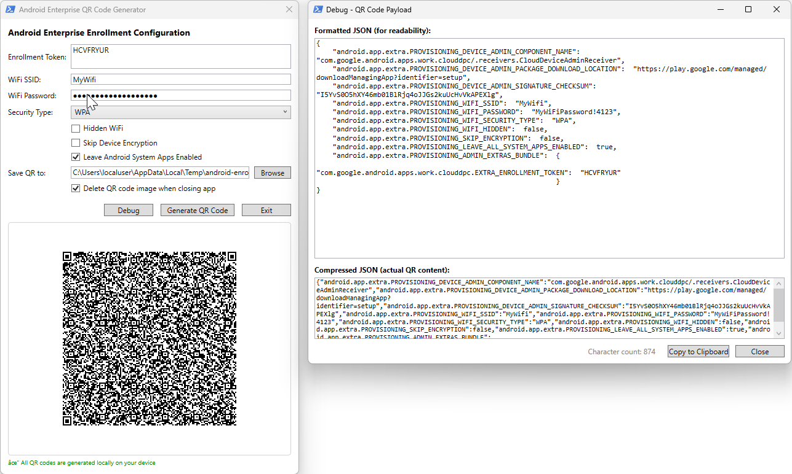

# Android Enterprise QR Code Generator

## Overview

The **Android Enterprise QR Code Generator** is a PowerShell-based tool with a graphical user interface (WPF) designed to accelerate the testing and deployment of Android Enterprise devices. It streamlines the enrollment process by generating QR codes that contain all the necessary provisioning information for device setup.

### Key Features

- **Enrollment Token Integration** – Embed your Intune or Google Workspace enrollment token directly into the QR code
- **Wi-Fi Auto-Configuration** – Pre-configure Wi-Fi credentials (SSID, password, security type) so devices automatically connect during enrollment without manual intervention
- **Skip Device Encryption** – Option to bypass device encryption during provisioning, useful for testing scenarios
- **Leave System Apps Enabled** – Keep Android system apps enabled during enrollment instead of hiding them
- **Hidden Wi-Fi Support** – Configure hidden Wi-Fi networks for secure environments
- **Local QR Generation** – All QR codes are generated locally on your device using the `QRCodeGenerator` PowerShell module, ensuring sensitive enrollment tokens never leave your machine
- **Debug Mode** – View the raw JSON payload before generating the QR code for troubleshooting
- **Auto-Cleanup** – Option to automatically delete the generated QR code image when closing the application

### User Interface



### Why Use This Tool?

When testing Android Enterprise enrollment profiles, IT administrators often need to repeatedly factory reset devices and re-enroll them. Manually entering Wi-Fi credentials and navigating through setup wizards can be time-consuming. This tool eliminates that friction by:

1. Pre-configuring network connectivity in the QR code
2. Embedding enrollment tokens for seamless MDM enrollment
3. Providing options to skip encryption and enable system apps for faster testing cycles

### Prerequisites

- **PowerShell 5.1** or later
- **QRCodeGenerator** PowerShell module (the script will attempt to install it automatically if missing)

```powershell
Install-Module -Name QRCodeGenerator -Scope CurrentUser
```

---

## Getting Started

This section will guide you through the initial setup and usage of the Android Enterprise QR Code Generator.

<!-- Add your getting started content here -->
