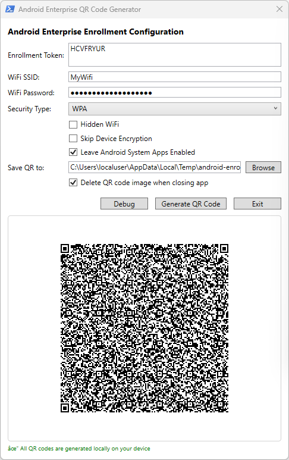
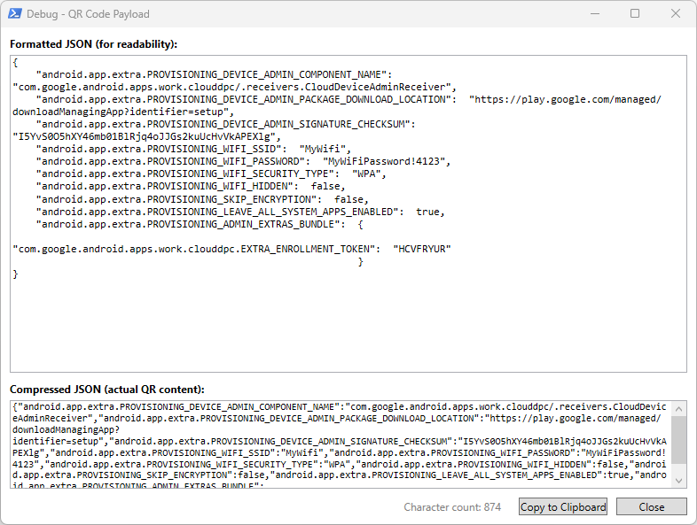

# Android Enterprise QR Code Generator

## 🎯 Overview

The **Android Enterprise QR Code Generator** is a PowerShell-based tool with a graphical user interface (WPF) designed to accelerate the testing and deployment of Android Enterprise devices. It streamlines the enrollment process by generating QR codes that contain all the necessary provisioning information for device setup.

### Key Features

- **Enrollment Token Integration** – Embed your Intune or Google Workspace enrollment token directly into the QR code
- **Wi-Fi Auto-Configuration** – Pre-configure Wi-Fi credentials (SSID, password, security type) so devices automatically connect during enrollment without manual intervention
- **Skip Device Encryption** – Option to bypass device encryption during provisioning, useful for testing scenarios
- **Leave System Apps Enabled** – Keep Android system apps enabled during enrollment instead of hiding them
- **Hidden Wi-Fi Support** – Configure hidden Wi-Fi networks for secure environments
- **Local QR Generation** – All QR codes are generated locally on your device using the `QRCodeGenerator` PowerShell module, ensuring sensitive enrollment tokens never leave your machine
- **Debug Mode** – View the raw JSON payload before generating the QR code for troubleshooting
- **Auto-Cleanup** – Option to automatically delete the generated QR code image when closing the application

### User Interface



### Debug Window



### Why Use This Tool?

When testing Android Enterprise enrollment profiles, IT administrators often need to repeatedly factory reset devices and re-enroll them. Manually entering Wi-Fi credentials and navigating through setup wizards can be time-consuming. This tool eliminates that friction by:

1. Field to enter the Enrollment Token, which you can copy from your Android Enrollment profile in Intune.
2. Allows embedding Wi-Fi network information into the QR code
3. Provides options to skip encryption and enable system apps
4. Generates the QR code locally and allows saving it for later use
5. Includes a debug option for analyzing the JSON data

### Prerequisites

- **PowerShell 5.1** or later
- **QRCodeGenerator** PowerShell module to generate the QR Code locally (the script will attempt to install it automatically if missing)

> **Note:** If the installation fails, please install the required module manually using the following command in Powershell:

```powershell
Install-Module -Name QRCodeGenerator -Scope CurrentUser
```

---

## 🚀 Getting Started

This section will guide you through the initial setup and usage of the Android Enterprise QR Code Generator.

### Option 1: Using the Batch File (Recommended)

The easiest way to run the tool is by double-clicking the included batch file:

1. Download the `AndroidEnterprise-QR-Generator` folder's content and navigate to that location on your computer
2. Double-click **`Run-QRGenerator.bat`**
3. The application will launch automatically

### Option 2: Using PowerShell Directly

If you prefer to run the script manually via PowerShell:

1. Open **PowerShell** (right-click → Run as Administrator if needed)
2. Navigate to the script directory:
   ```powershell
   cd "C:\Path\To\AndroidEnterprise-QR-Generator"
   ```
3. Run the script with the execution policy bypass:
   ```powershell
   powershell.exe -ExecutionPolicy Bypass -File ".\AndroidEnterprise-QR-Generator.ps1"
   ```

> **Note:** The `-ExecutionPolicy Bypass` parameter temporarily allows the script to run without modifying your system's execution policy. This setting only applies to the current PowerShell session.

---

## ⚠️ Disclaimer

This script is provided **as-is** without any warranty or support. The author assumes no responsibility for any issues, damages, or unintended consequences arising from the use of this tool. Use it at your own risk.

This project is offered to the public for educational and testing purposes. No official support, maintenance, or updates are guaranteed. By using this script, you acknowledge and accept these terms.
